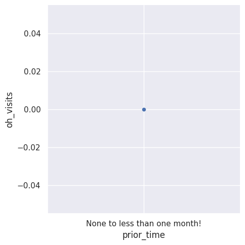
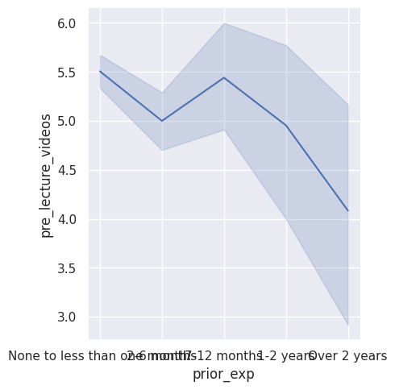
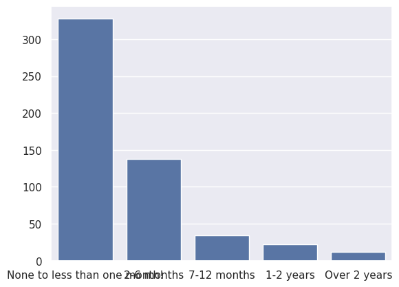

---
# Do not edit the text between these lines!
layout: default
---

# COMP110 EX09 Mahwish and Nivedha!

<!-- This is a comment. Below, you'll see code for inserting an image. To make this image appear, update <custom-path>. To add an image, save it inside the imgs folder of this repository. -->

## Summary

Survey responses from the CSV file survey_izzi.csv were loaded in with read_csv_rows, converted to column form with columnar, combined with concat, and narrowed with select.

The research question was whether students would need and want more guidance with exercises. We evaluate this by examining the parameters of prior_experience, pre_lecture_videos, and oh_visits. We believe these parameters to give insight into whether students will generally benefit from greater guidance.

## Figures
We created three plots via the seaborn module to visualize the data that supported our claim. First, we created a scatterplot comparing students' prior experience with self directed coding with the number of office hour visits. Second, we created a line plot that looked at the prior experience with self directed coding and the desire for pre-lecture videos measured by a Likert scale. Finally, we created a simple bar graph showing the number of students who are in each category of prior experience with self-directed coding. 

Figure 1:

Figure 2:

Figure 3:

## Conclusion

What we found: 

In order to answer our research question, we created the above statistical plots. 

Looking at Figure 1, we can conclude that there is a positive and direct correlation with a COMP110 student's prior time spend coding and the amount of office hour visits. It is indicated that the less prior time students have spent coding, the more office hour visits they attend. This proves our research theory that COMP110 should provide more guidance on the exercises and should provide pathways for students to learn more throroughly within the alloted lecture times so that they can prevent attending office hours so much. 

Looking at Figure 2, we can identify that there is a slight jump in the line plot in the middle near 7-12 months of prior experience. However, there is a correlation between the amount of prior experience a student has and how interested they are in pre-lecture videos. We can observe that although there is a slight jump in the graph, the overall trend is that the less experience a student has coding prior to this class, the more interested they are in pre-lecture videos. This demonstrates how students are desiring extra help before the lectures as lectures can be long and information heavy. Having little to no experience calls for pre-lecture videos that could prepare students for what they are about to learn in lecture that day. 

Looking at Figure 3, we can see that is is clearly illustrated how the majority of COMP110 students have "none to less than one month of experience." The second most majority goes to students with 2-6 months of experience, which is not a lot of experience either. This shows how most of the COMP110 studnets are coming in knowing nothing about coding, let along VS code. This should highlight how lectures and exercises should provide more guidance to students as they might feel like they are thrown in the deep waters from the get-go. This is not fair to students, let alone informative as students may resort to other tactics to learn rather than actually absorbing the information taught in lectures and exercises. 

Based on our analysis, we recommend that COMP110 should incorporate structured support for beginners, such as walkthroughs during lecture directed towards the exercises, pre-lecture quizzess and videos, step-by-step instructions for assignments, and more. These implementations would bettr support students with little to no prior experience, who are the majority of the sample from the survey.

Improvements:

Future improvements could include interactive coding tutorials, adaptive assignments that do not require frequent office hours visits (like the current exercises do). Additionally, grasping what concepts students are struggling with and creating more thorough walk-throughs of these assignments in lectures could be efficient. 

Trade-Offs: 

While these ideas could slow down the pace of the 50-minute lectures, it is more important to focus on how much the students are absorbing rather than getting through the curriculum. Additionally, this may create extra work for the intructor and TAs if extra pre-lecture videos and quizess were provided. 

Overall, the data given suggests that students with less prior experience rely heavily on office hours and show interest in pre-lecture videos. This indicates a disparity between the course structure and students' perparedness. 
